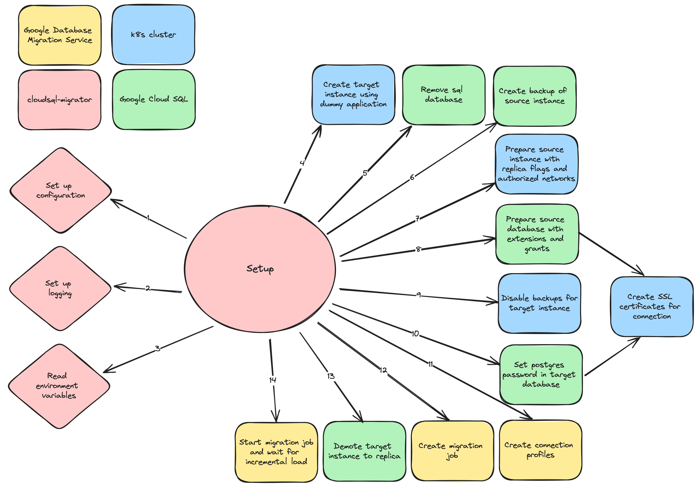
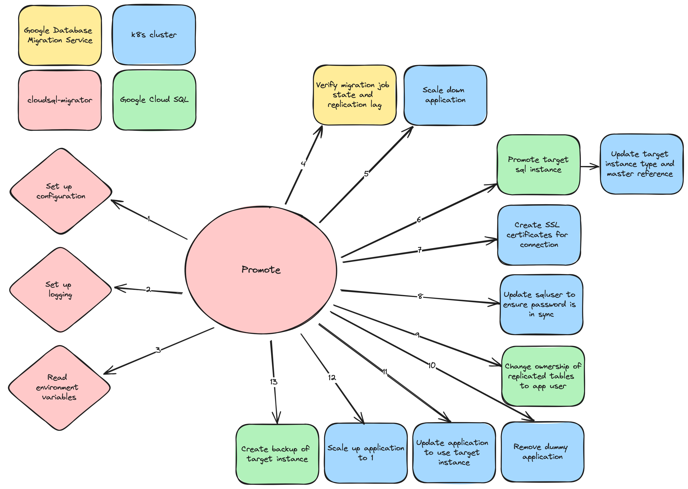

CloudSQL-migrator
=================

Tool to migrate between Cloud SQL instances in the nais platform.

## How does it work

Three phases are executed during the migration operation: Setup, Promotion, Cleanup

Setup creates the new SQL instance based on the parameters provided for the migration job. These parameters are described in detail later.
The connection profiles and the migration job itself is also created in this phase, and when finished is running the new instance as a replica of
the original instance incrementally loading changes into the replica.



Promotion verifies that the migration job is in the correct phase, and that the replication lag is zero (i.e. we know that the databases are synchronized). 
The application is scaled down before the replica is promoted to a standalone database instance. The application is then configured to use the new instance, 
before the application is scaled up again. These changes needs to be reflected in the application spec before the next deploy.
All down time for the migration operation is incurred in this phase.



Cleanup removes unused kubernetes resources and google cloud resources. This phase should be executed after the teams have verified that the application
is working as expected.

Before setup and after promotion we create a backup of the instance in use.


## How to use

### Command line

Run the application from command line with environment variables exported. 

You can build the executable files by typing:
```shell
make
```

#### Environment variables
| Variable                 | Description                          | Required |
|--------------------------|--------------------------------------|----------|
| APP_NAME                 | Name of the application              | Yes      |
| NAMESPACE                | Namespace of the application         | Yes      |
| TARGET_INSTANCE_NAME     | Name of the target sql instance      | Yes      |
| TARGET_INSTANCE_TIER     | Tier of the target sql instance      | No       |
| TARGET_INSTANCE_DISKSIZE | Disk size of the target sql instance | No       |
| TARGET_INSTANCE_TYPE     | Type of the target sql instance      | No       |

Setup the migration job and start replicating:
```shell
cloudsql-migrator setup 
```
After setup has finished your database is replicated continuously, continue with the next phase when 
you are ready to make use of the new instance.

Promote the instance:
```shell
cloudsql-migrator promote
```
After promote has finished your application is using the new instance, the application spec needs to be updated to reflect the changes.
This will always include the new name of the instance, and possibly the tier, disksize and type of the instance.


Clean up the resources when migration is completed:
```shell
cloudsql-migrator cleanup
```

## Detailed description of the phases

### Phase 1: Setup

1. Take an explicit backup before starting
2. Set up a new SQLInstance that is the way you want it to be
   - Must create sqlinstance, sqluser and sqlsslcert resources for the new instance, with the correct owner reference
   - Do not create a sql database, because it will be replicated from the old db
3. Configure source instance for migration:
   - Set flags on the instance:
     - cloudsql.logical_decoding=on
     - cloudsql.enable_pglogical=on
   - Install the pglogical extension and grant rights to the postgres user in all databases:
    
     ```sql
     CREATE EXTENSION IF NOT EXISTS pglogical;
     GRANT USAGE on SCHEMA pglogical to "postgres";
     GRANT SELECT on ALL TABLES in SCHEMA pglogical to "postgres";
     GRANT SELECT on ALL SEQUENCES in SCHEMA pglogical to "postgres";
     GRANT USAGE on SCHEMA public to "postgres";
     GRANT SELECT on ALL TABLES in SCHEMA public to "postgres";
     GRANT SELECT on ALL SEQUENCES in SCHEMA public to "postgres";
     ALTER USER "postgres" with REPLICATION;
     ```
4. Set up Database Migration
   - Create migration job
   - Create connection profile for the source instance
   - Create connection profile for the target instance
   - Set the correct allowlist for the source instance (primary and outgoing IP)
   - Start migration job
   - Wait for initial load replication...

### Phase 2: Promotion

When the replica is up-to-date

1. Scale the app down to 0 replicas
2. When replica lag is 0, start promoting replica
3. Wait for promotion complete
4. Fix ownership in the database
5. Change the Application in the cluster to match the new instance, still with 0 replicas
   - Remember not to delete source instances
6. Scale up the app to the desired number of replicas
7. Take an explicit backup after upgrading

### Phase 3: Cleanup

Once the migration is verified and everything is working as it should

1. Delete migration job
2. Delete the connection profile
3. Delete "master" instance
4. Delete old resources
   - SQLInstance
   - SQLUSers
   - SQLSSLCert

## Local development

When running locally, you must have a working kubernetes config with current-context for the cluster and namespace you want to work with.
You need to log in using cloud and update ADC with the correct project and user.

It is recommended to set the following environment variables:

| Variable                                 | Description                                                                                                                                                                    |
|------------------------------------------|--------------------------------------------------------------------------------------------------------------------------------------------------------------------------------|
| `DEVELOPMENT_MODE_SKIP_BACKUP=true`      | Skip creating backups. These take long to create, and if developing, the backup is probably not needed.                                                                        |
| `DEVELOPMENT_MODE_UNSAFE_PASSWORD=true`  | During setup/promotion, the password for the `postgres` user is changed. This setting makes the password always be `testpassword`.                                             |
| `DEVELOPMENT_MODE_ADD_AUTH_NETWORK=true` | Parts of setup/promotion requires connecting to the instances. This settings adds the outgoing IP of the machine running setup/promote to authorized networks on the instance. |
